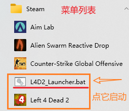

# L4D2 OfflineAssistant

This is an addon designed for Chinese players in the beginning.

这个程序最初是为中国区玩家设计的。

- 游戏：Left 4 Dead 2(求生之路2)
- 针对：游戏附件（MODs）
- 目标：确保游戏启动时所有准备好的*附件*(*Mod*)都在目录(*addon/workshop*)中。
- 效果：
  - 确保不会被清除
  - 确保附件存在

## 为什么需要

对于中国区玩家，在Steam创意工坊下载Mod往往需要开启加速器。而这个游戏在游戏内下载，如果下一次启动时没有开启加速器，那么这一次下载的Mod都会被**清除**。

> 在某一次进入游戏内附件管理界面后，退出时会保存当前勾选配置，而未加载出的附件则会在下次加载出的同时被设为“勾选”，无论您原本是否勾选。

我知道，虽然有一种广传的方法避免从创意工坊拉取，但是**那种方法**会导致==图片和描述无法加载、描述乱码、无法链接创意工坊查看详情==等问题。

> 指的是：将附件从'addons/workshop'移出到'addons'


<p style="color:red; font-weight:bold">使用本程序，您可以实现：资源来自本地，描述来自网络。</p>

这样一来，可以确保每次启动所有附件都存在，且描述将会从互联网加载，无描述失效、无乱码、**便于管理**！

## 安装、配置及使用方法

### 安装

下载并解压项目，并确保`autocheck.bat`和`L4D2_Launcher.bat`位于`SteamLibrary\steamapps\common\Left 4 Dead 2\left4dead2\addons`目录下。

> 其实只要确保前者，不过后者就得配置路径了。

然后为`L4D2_Launcher.bat`添加快捷方式到..(桌面？菜单列表？)

### 配置

使用前您应该确保您已配置。在`addons\`下准备好一个文件夹，尽量不要特殊字符包括中文，然后将`autocheck.bat`中的`profile1`替换成新文件夹的名称。

``` bash
set profile=profile1
```

> 1. 您也可以将新文件夹命名为profile1。
> 2. 所有面向用户的设置项尽在`rem Settings`语句下到空行截止。

将附件放入新文件夹中。

### 使用

运行`L4D2_Launcher.bat`即可。

## 图示

文件描述（像这就配好了的）：


我把快捷方式弄到菜单列表里去了：



> [C:\ProgramData\Microsoft\Windows\Start Menu\Programs\Steam]
>
> 或
>
> [%AppData%\Steam]

## 原理

1. 检查在`addons/workshop/`中的标记文件`Amark.txt`是否存在
2. 使用`robocopy`命令从指定目录恢复/补充附件。

### 可选更改

因为我也不太确定附件相关的机制，可能标记文件压根不会被删除，所以以下提供一个修改方法，供选用。如果有哪位热心的网友能给我讲讲机制，那可太好了！

将结构：

``` bash
REM 原代码
:loop

    if exist "%markpath%" (
    	...a
    	goto loop
    ) else (
    	...b
    )

```

改为结构：

``` bash
REM 改动后的代码
:loop
    	...b
    	goto loop
 
```

其中，`...a`和`...b`代表省略的内容，`...b`中的`echo mark>>"%markpath%"`可以一并删去。如此一来，`robocopy`会一直工作，一直检查并确保文件存在。(`robocopy`会跳过已存在文件)

## 没有robocopy可用？

您的电脑真是极品！

现在极少电脑无法使用这个命令。

提供两个解决方法：

1. 换个新电脑	(o_<) wink~
2. 去下载一个`robocopy.exe`（推荐）
3. 使用我先前的一个项目：`mcmod`。这个项目使用`copy`或`xcopy`命令，您只需配置好路径即可使用。同时，您仍然可以使用本项目的`L4D2_Launcher.bat`，只需将其中调用的`autocheck.bat`更改为`run.bat`以匹配`mcmod`项目。
   项目链接：[LiuJiewnTT/mcmod](https://github.com/LiuJiewenTT/mcmod)

## 关于项目

项目链接：https://github.com/LiuJiewenTT/L4D2_OfflineAssistant

网页链接：https://liujiewentt.github.io/L4D2_OfflineAssistant/README

下载autocheck.bat：

1. dev: https://github.com/LiuJiewenTT/L4D2_OfflineAssistant/raw/main/autocheck.bat
2. release: https://github.com/LiuJiewenTT/L4D2_OfflineAssistant/releases/

授权：本项目使用MIT开源协议。请署名作者及协议。协议内容见`LICENSE`文件。